# ATC FieldConnect

**Capture Visits. Discover Opportunities. Grow Business.**

A production-ready, **offline-first** mobile application for **ATC Group** field-sales
and service employees. It records client visits, captures location photos and GPS,
documents existing systems / printers / consumables, assesses business opportunities,
and generates a professional **day-end Excel report** — all **without any backend,
cloud server, or online database**.

> Developed by ATC Group

---

## 📱 Screenshots

An elegant green-and-white design system: gradient headers, rounded cards, soft
shadows, animated counters, chips and badges, sticky action bars and premium
empty states — edge-to-edge and safe-area aware.

### Android

| Dashboard | New Visit (step 1 of 11) | Visit Details |
|:---:|:---:|:---:|
| 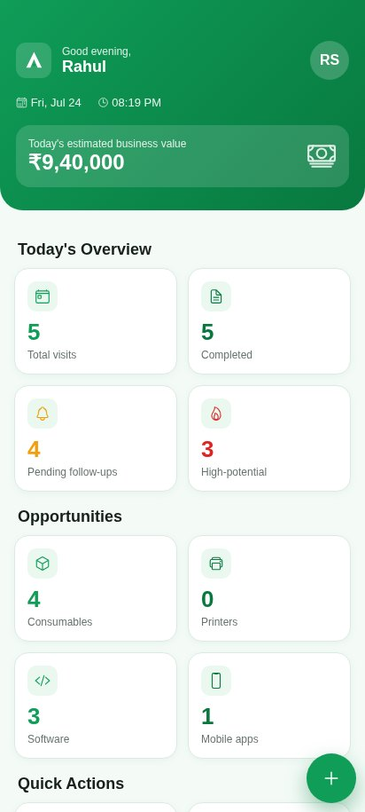 | 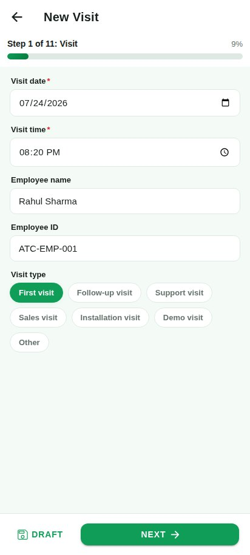 | 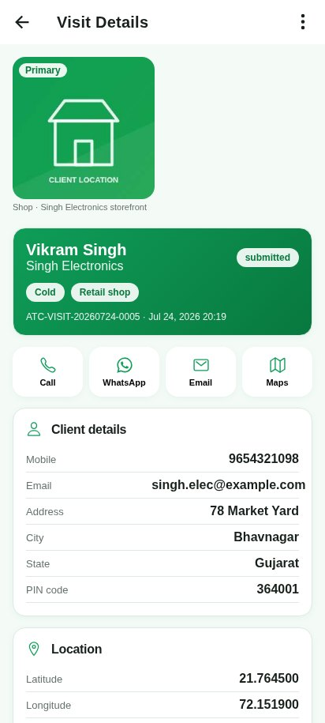 |

| Day-End Report | Today's Visits | Opportunity Assessment |
|:---:|:---:|:---:|
| 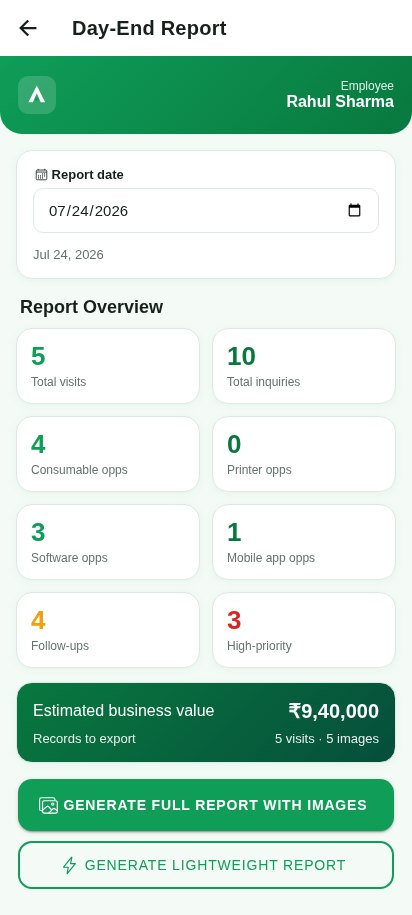 | 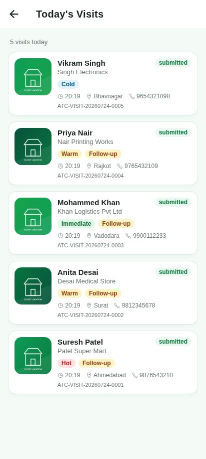 | 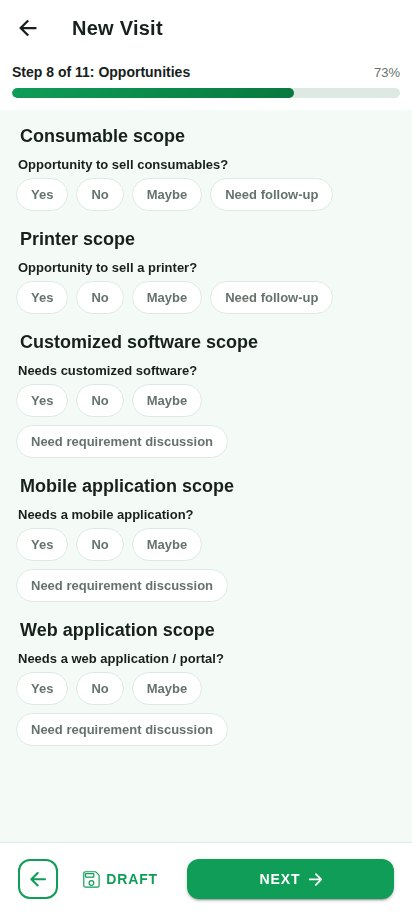 |

<details>
<summary><b>More Android screens</b> — splash, employee setup, all visits, follow-ups, settings, about</summary>

| Splash | Employee Setup | All Visits |
|:---:|:---:|:---:|
| 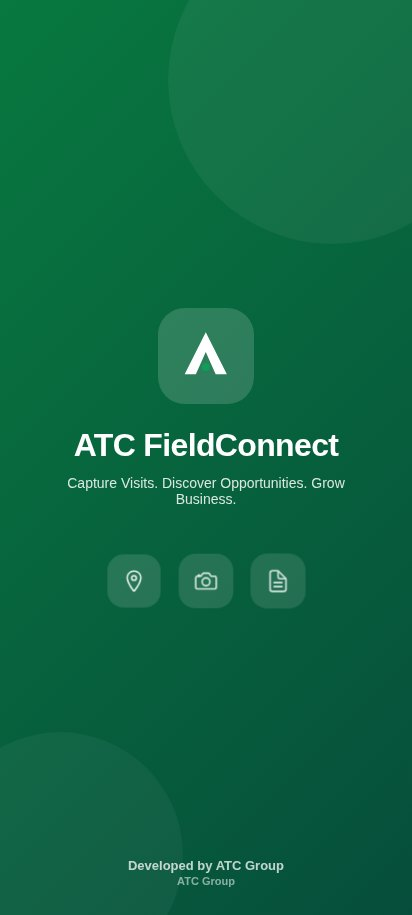 | 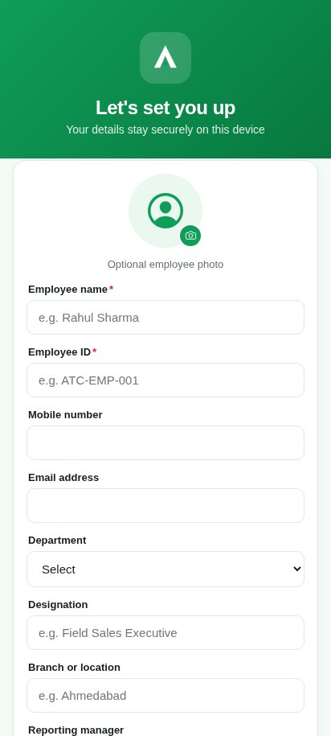 | 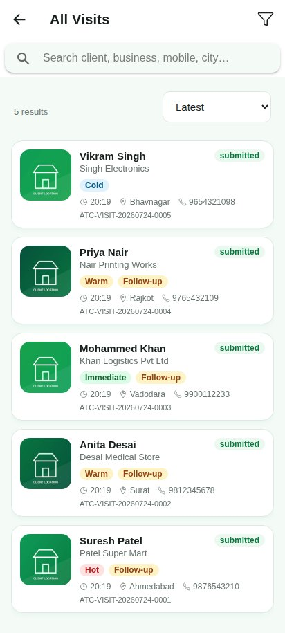 |

| Follow-ups | Settings | About |
|:---:|:---:|:---:|
| 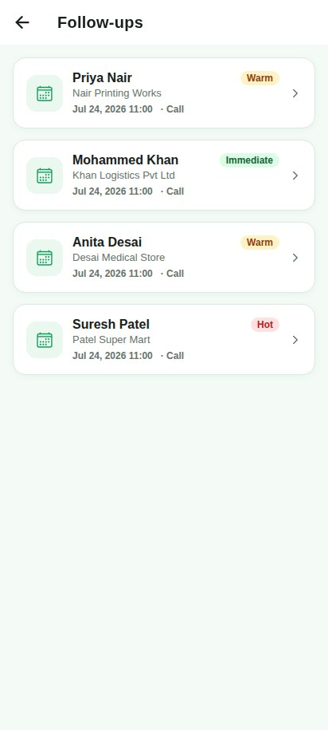 | 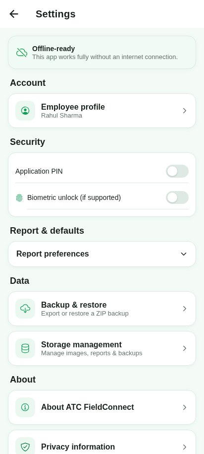 | 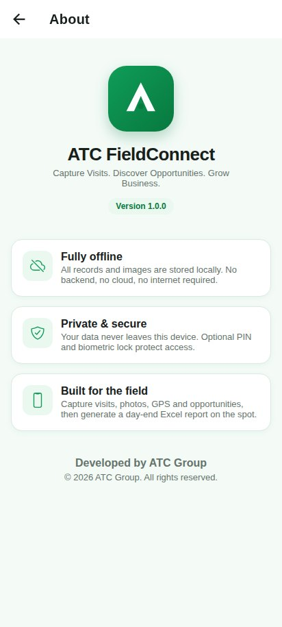 |

</details>

### iOS

| Dashboard | New Visit | Visit Details |
|:---:|:---:|:---:|
| 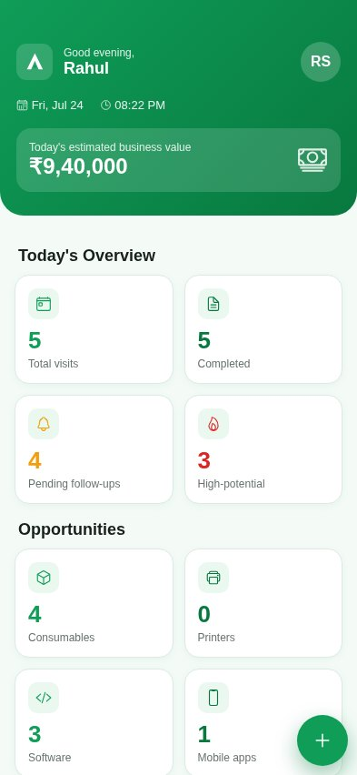 | 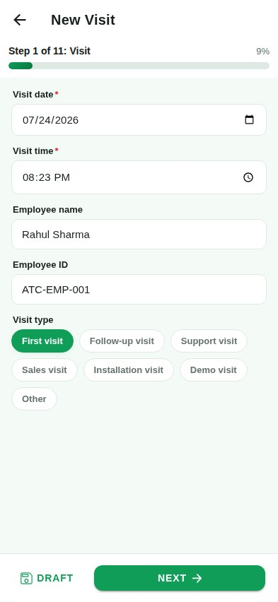 | 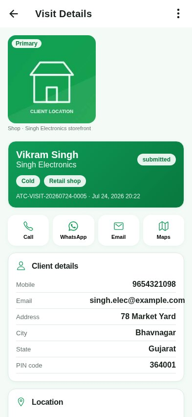 |

| Day-End Report | Today's Visits | Settings |
|:---:|:---:|:---:|
| 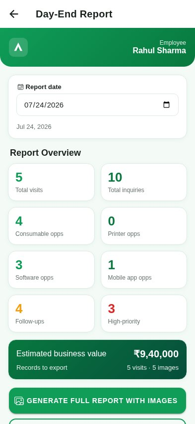 | 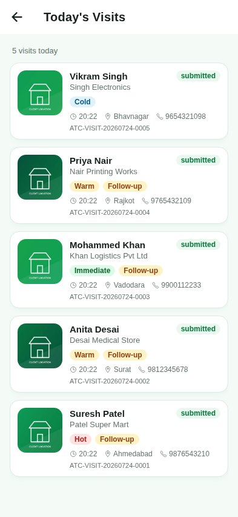 | 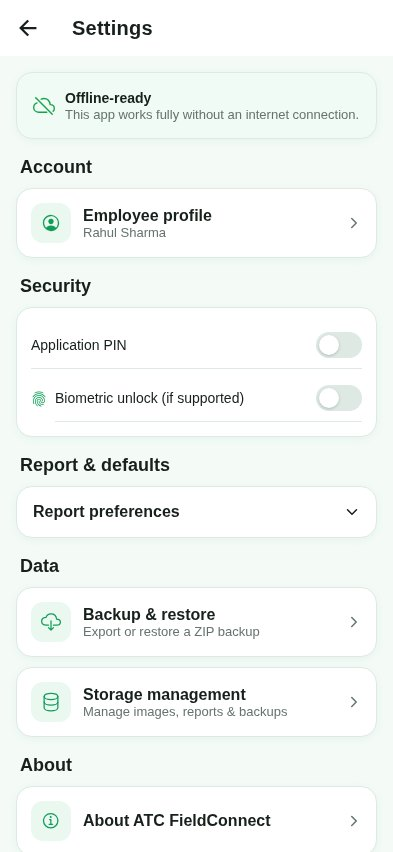 |

<details>
<summary><b>More iOS screens</b> — splash, employee setup, all visits, opportunities, follow-ups, about</summary>

| Splash | Employee Setup | All Visits |
|:---:|:---:|:---:|
| 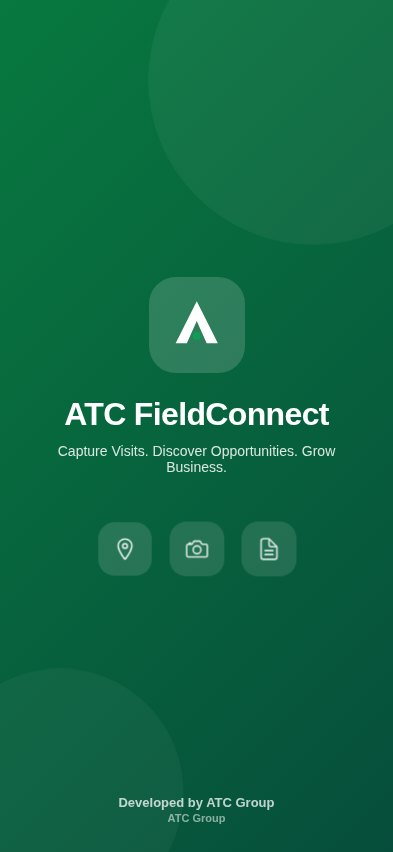 | 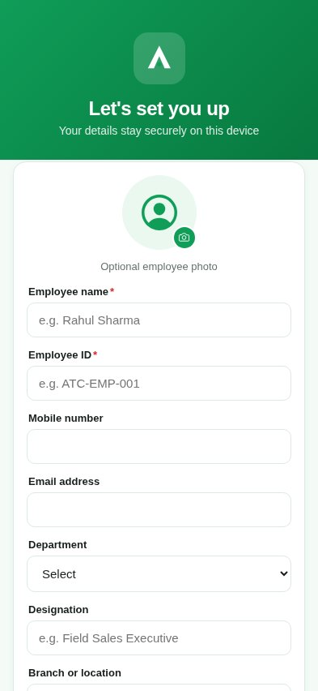 | 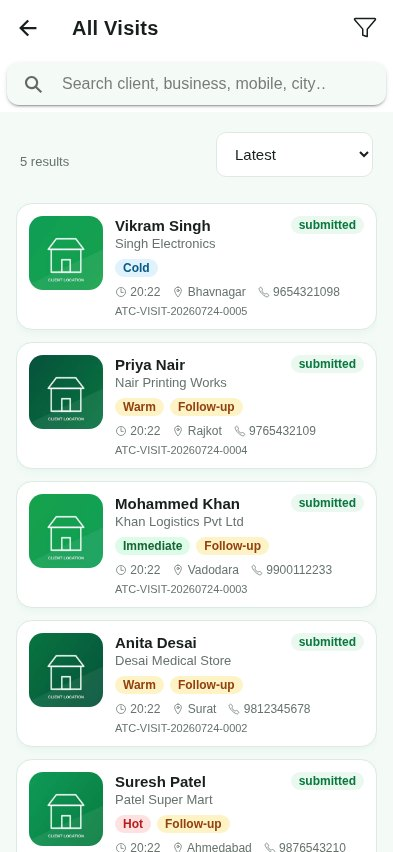 |

| Opportunities | Follow-ups | About |
|:---:|:---:|:---:|
| 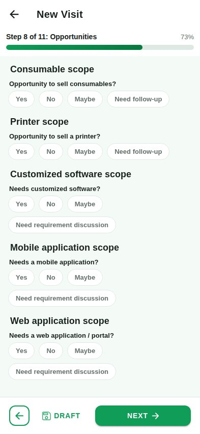 | 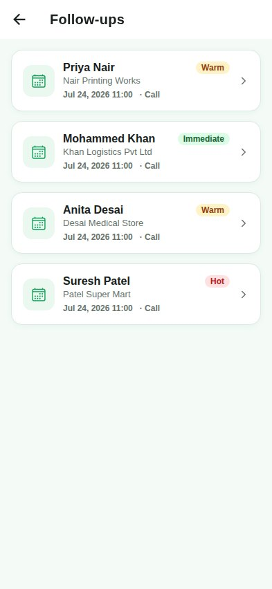 | 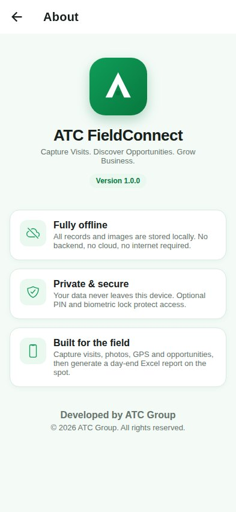 |

</details>

> **How these were captured.** These are real screenshots of this codebase running
> in a mobile viewport — Android at 412 × 915 (Pixel-class) and iOS at 393 × 852
> (iPhone-class) — populated with the app's built-in sample visits, not mockups.
> The two sets look alike by design: Ionic's mode is pinned to Material
> (`setupIonicReact({ mode: 'md' })` in `src/App.tsx`) so ATC Group's branding stays
> identical on both platforms. The Android project ships in `android/`; the iOS
> target is not generated yet (`npx cap add ios`), so the iOS images show the same
> build at iPhone dimensions rather than a Simulator capture. Client photos in the
> samples are generated placeholders.

---

## ✨ Highlights

- 📵 **100% offline** — SQLite database + device file storage, no internet required
- 📸 **Camera & gallery** capture with automatic image compression (paths stored in SQLite, not blobs)
- 📍 **GPS capture** that works offline (coordinates only, no map tiles needed)
- 📊 **Excel report generation** (ExcelJS) with **embedded client images** across 5 styled sheets — [download a sample report ⬇](docs/sample-report/ATC_FieldConnect_Day_End_Report_RahulSharma_2026-07-24.xlsx)
- 🔁 **Auto-save drafts** so an accidental close never loses work
- 💾 **Local backup & restore** as a single ZIP (database + images + profile + settings)
- 🔐 **Optional 4-digit PIN + biometric** lock, session timeout, on-device-only data
- 🟢 Premium **green-and-white** UI with smooth animations, skeletons, empty states
- 🔔 **Local notification reminders** for follow-ups

---

## 🧱 Tech Stack

| Layer | Technology |
|-------|-----------|
| UI | React 18 + TypeScript + Ionic React |
| Native shell | Capacitor 6 (Android-first, iOS-ready) |
| Local DB | `@capacitor-community/sqlite` (jeep-sqlite web store for browser preview) |
| Files | `@capacitor/filesystem` |
| Camera | `@capacitor/camera` |
| Location | `@capacitor/geolocation` |
| Sharing | `@capacitor/share` |
| Notifications | `@capacitor/local-notifications` |
| Excel | ExcelJS |
| Backup | JSZip |

**No** Node backend, Express, PostgreSQL, Firebase, Supabase, cloud storage, online APIs,
server auth, or web admin portal are used anywhere.

---

## 🚀 Getting Started

### Prerequisites
- Node.js 18+ and npm
- For Android builds: Android Studio + JDK 17 + Android SDK

### Install & run the web preview
```bash
npm install
npm run dev
```
Open http://localhost:5173. The browser preview uses the jeep-sqlite web store so you can
exercise the full flow (sample data is seeded automatically on first run). Camera capture
in the browser falls back to the OS file picker; native camera/GPS/sharing require a device build.

### Type-check & production web build
```bash
npm run build
```

### Unit tests
Vitest + React Testing Library. Every page has a render test and the core logic
(validation, formatting, Excel generation) is unit-tested.
```bash
npm test            # run once (35 tests across 18 files)
npm run test:watch  # watch mode
```
Native plugins, SQLite, camera, GPS and the filesystem are mocked in
`src/test/setup.ts`, so the suite runs fast in jsdom without a device.

---

## 🤖 Android Build & APK

1. **Build the web assets and sync into the native project**
   ```bash
   npm run android:build      # = npm run build && cap sync android
   ```

2. **Open in Android Studio**
   ```bash
   npm run cap:android        # = cap open android
   ```

3. **Run on a device/emulator** directly:
   ```bash
   npm run android:run        # build + sync + run
   ```

### Generate a debug APK (CLI)
```bash
npm run android:build
cd android
./gradlew assembleDebug
# APK: android/app/build/outputs/apk/debug/app-debug.apk
```

### Generate a signed release APK / AAB
```bash
# 1. Create a keystore (once)
keytool -genkey -v -keystore atc-fieldconnect.keystore \
  -alias atc -keyalg RSA -keysize 2048 -validity 10000

# 2. Configure signing in android/app/build.gradle (signingConfigs)
# 3. Build
cd android
./gradlew assembleRelease      # APK
./gradlew bundleRelease        # AAB for Play Store
```

Whenever web code changes, re-run `npm run android:build` before rebuilding in Android Studio.

---

## 📁 Project Structure

```
src/
  components/      common/ · forms/ · visits/ · images/
  pages/           Splash, EmployeeSetup, PinLogin, Dashboard, NewVisit,
                   VisitDetails, TodayVisits, AllVisits, FollowUps, Reports,
                   Settings, Profile, BackupRestore, StorageManagement, About
  services/        database/ · camera/ · filesystem/ · geolocation/
                   excel/ · backup/ · notifications/ · security/ · draft/ · seed/
  hooks/           AppContext (DB bootstrap, profile, toast, haptics)
  types/           domain models
  constants/       option lists & branding
  utils/           validation, formatting
  theme/           green/white variables + global styles & animations
```

---

## 🗄️ Local Data Model

A relational SQLite schema lets multiple systems, printers, consumables, images and
inquiries attach to a single visit:

`employee_profile`, `client_visits`, `visit_images`, `existing_systems`,
`printer_details`, `inquiry_categories`, `consumable_opportunities`,
`printer_opportunities`, `software_opportunities`, `mobile_app_opportunities`,
`follow_ups`.

Visit numbers are generated locally as `ATC-VISIT-YYYYMMDD-0001`.

---

## 📊 Excel Report

`ATC_FieldConnect_Day_End_Report_<Employee>_<YYYY-MM-DD>.xlsx` with five sheets:

1. **Day-End Summary** — styled totals, green headers, merged branding cells
2. **Client Visit Details** — 60 columns incl. embedded primary image per row
3. **Opportunity Summary** — one row per opportunity
4. **Follow-Up Report**
5. **Visit Images** — all captured images with captions

Reports come in **Full (with images)** and **Lightweight** variants, generate
asynchronously with a progress indicator, and can be shared to WhatsApp / Email /
Drive / Bluetooth / File manager via the OS share sheet.

### 📥 Download a sample report

These are **real files produced by the app** — generated on the Day-End Report
screen from the five built-in sample visits, exactly as an employee receives them.

| Sample file | Variant | Size | Contents |
|---|---|---|---|
| **[⬇ ATC_FieldConnect_Day_End_Report_RahulSharma_2026-07-24.xlsx](docs/sample-report/ATC_FieldConnect_Day_End_Report_RahulSharma_2026-07-24.xlsx)** | Full — with images | 53 KB | 5 sheets · **10 embedded photos** |
| **[⬇ ..._2026-07-24_Lightweight.xlsx](docs/sample-report/ATC_FieldConnect_Day_End_Report_RahulSharma_2026-07-24_Lightweight.xlsx)** | Lightweight | 13 KB | 4 sheets · no images |

What's inside the full sample:

| Sheet | Rows | Columns | Embedded images |
|---|---:|---:|---:|
| Day-End Summary | 17 | 4 | — |
| Client Visit Details | 6 (header + 5 visits) | **60** | 5 (primary photo per visit) |
| Opportunity Summary | 9 (header + 8 opportunities) | 11 | — |
| Follow-Up Report | 5 (header + 4 follow-ups) | 11 | — |
| Visit Images | 6 (header + 5 images) | 7 | 5 |

The Lightweight variant carries the same 60-column detail sheet and totals but
drops all images and the *Visit Images* sheet — a 4× smaller file for quick
sharing over patchy field connections.

> Regenerate them any time with `node scripts/generate-sample-report.mjs`
> (see the script header for prerequisites). The sample client photographs are
> generated placeholders, not real client premises.

---

## 🔒 Privacy

All records and images live **only** on the device. Nothing is uploaded. Uninstalling
the app removes local data — use **Backup & Restore** to keep it safe.

---

## 🖼️ Replacing the Logo

`src/components/common/AtcLogo.tsx` is a self-contained placeholder. Swap its inner SVG
(or drop in an `` with the official asset) — every screen updates automatically.

See [`CHECKLIST.md`](./CHECKLIST.md) for the full requirement-by-requirement status.
